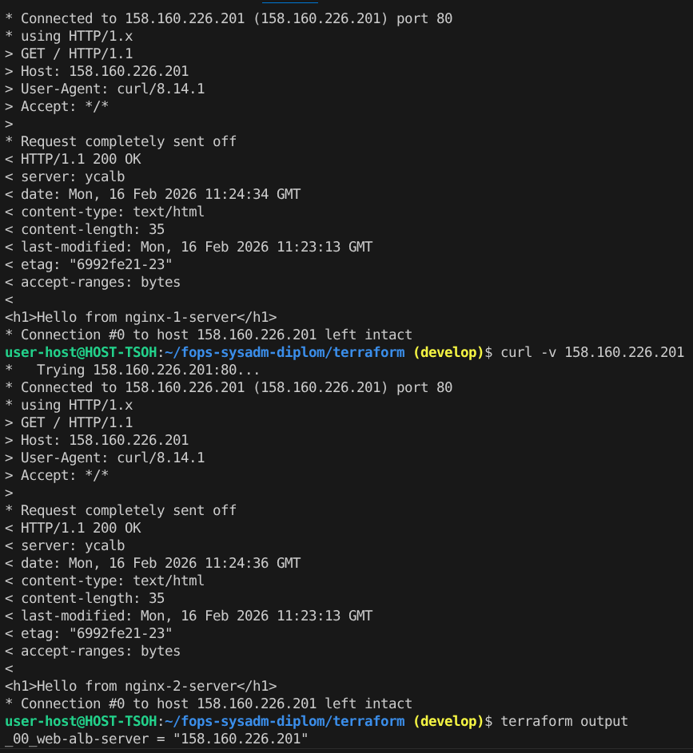
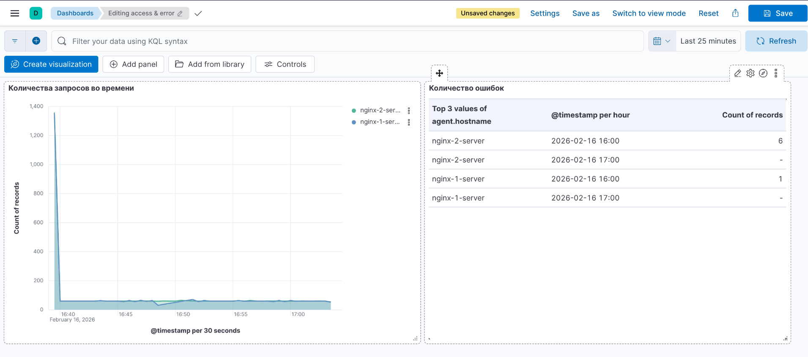
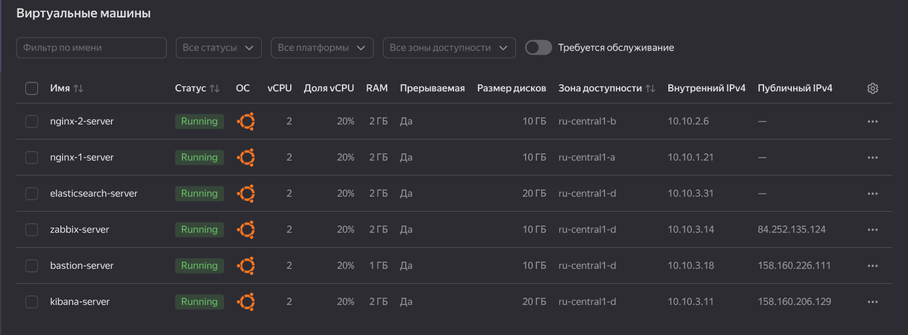

#  Курсовая работа на профессии "DevOps-инженер с нуля"

[Задание](ZADANIE.md)

## Инфраструктура

Все конфигурационные файлы организованы по соответствующим директориям:

[Terraform](terraform/) - код инфраструктуры.

[Cloud-init](cloud-init/) - скрипты инициализации виртуальных машин.

[Ansible](ansible/playbook/) - плейбуки для настройки серверов.

### Сайт

В рамках развертывания инфраструктуры с помощью Terraform создаются [два виртуальных сервера](terraform/09_nginx.tf) с первичной настройкой, указанной в [cloud-init](cloud-init/cloud-init-nginx.yml), также через данный скрипты инициализации происходит установка на данные машины zabbix-agent. На заключительном этапе подготовки окружения задействуется Ansible: с его помощью на серверах [генерируется простой веб-сайт](ansible/playbook/05_install_packages_nginx.yml), отображающий hostname каждого из экземпляров. Для балансировки нагрузки сконфигурирован [Application Load Balancer](terraform/07_load_balancer.tf), опирающийся на созданные [Target Group](terraform/05_backend_group.tf), [Backend Group](terraform/05_backend_group.tf) и [HTTP-роутер](terraform/06_http_router.tf)

**Тестирование свйта через curl -v:**



### Мониторинг

Для мониторинга инфраструктуры разворачивается отдельная [виртуальная машина с Zabbix Server](terraform/10_zabbix.tf), конфигурация которого задается через [cloud-init](cloud-init/cloud-init-zabbix.yml). Настройка Zabbix-агентов на целевых хостах выполняется с помощью Ansible. Плейбук для Ansible динамически [генерируется на этапе работы Terraform](terraform/82_zabbix_agent.tf), что позволяет подставлять актуальные IP-адреса агентов, которые меняються при повторных развертываниях в обблаке.

### Логи

Развертывание стека мониторинга и логирования:

Установка Docker происходит на этапе инициализации виртуальных машин через cloud-init.

* [Elasticsearch](cloud-init/cloud-init-elasticsearch.yml): поднимается на отдельной виртуальной машине в Docker-контейнере. Сам Docker устанавливается на хосте с помощью Ansible-плейбука, который [динамически генерируется Terraform](terraform/83_ansible_elasticsearch.tf) (с учетом актуальных IP-адресов).

* [Filebeat](cloud-init/cloud-init-nginx.yml): аналогичным образом разворачивается на серверах с Nginx. Его конфигурация и запуск также выполняются через Ansible-плейбук, [создаваемый Terraform](terraform/84_ansible_filebeat.tf).

* [Kibana](cloud-init/cloud-init-kibana.yml): устанавливается по тому же принципу — в Docker-контейнере на отдельной ВМ, с использованием сгенерированного плейбука в [Terraform для подстановки адреса Elasticsearch](terraform/85_ansible_kibana.tf).

#### Готовые шаблоны для импорта:

В Kibana откройте **Stack Management** -> **Saved Objects** -> **Import**

[Расположены в директории](kibana/).

Визуально выглядит:



### Сеть

* Создан один [VPC](terraform/02_network.tf)

* Настроена [Security Groups](terraform/03_security_group.tf) 

**Пример публичной сети на [bastion](terraform/13_bastion.tf):**

```bash
  network_interface {
    subnet_id = yandex_vpc_subnet.subnet_d.id
    nat       = true
    security_group_ids = [yandex_vpc_security_group.bastion_sg.id]
  }
```

**Пример приватной сети на [elasticsearch](terraform/11_elasticsearch.tf):**

```bash
  network_interface {
    subnet_id = yandex_vpc_subnet.subnet_d.id
    nat       = false
    security_group_ids = [yandex_vpc_security_group.elasticsearch_sg.id]
  }
```

**После подьёма всех виртуальных машин выгядит таким образом:**



### Резервное копирование

Был создан snapshot дисков всех ВМ путём [terraform](terraform/79_snapshot_schedule.tf).